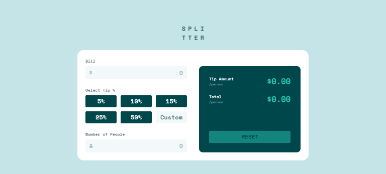

# Frontend Mentor - Tip calculator app solution

This is a solution to the [Tip calculator app challenge on Frontend Mentor](https://www.frontendmentor.io/challenges/tip-calculator-app-ugJNGbJUX). Frontend Mentor challenges help you improve your coding skills by building realistic projects.

## Table of contents

- [Overview](#overview)
  - [The challenge](#the-challenge)
  - [Screenshot](#screenshot)
  - [Links](#links)
- [My process](#my-process)
  - [Built with](#built-with)
  - [What I learned](#what-i-learned)
  - [Continued development](#continued-development)
- [Author](#author)

## Overview

### The challenge

Users should be able to:

- View the optimal layout for the app depending on their device's screen size
- See hover states for all interactive elements on the page
- Calculate the correct tip and total cost of the bill per person

### Screenshot

### Links

- Solution URL: [Solution](https://github.com/socratesioa/tip-calculator-app)
- Live Site URL: [Live Site](https://socratesioa.github.io/tip-calculator-app/)

## My process

### Built with

- Semantic HTML5 markup
- CSS custom properties
- Flexbox
- CSS Grid
- Mobile-first workflow
- JavaScript

### What I learned

It was nothing really new here as most of the things I had to do at least a couple of times before. However, putting everything together made it more difficult. Some of the things I had to do here, I only encountered once or twice before. Such as using radio inputs and hiding them in order to get the appearance required. To achieve that I styled the labels instead. Overall it was great practice in JavaScript.

### Continued development

As I am feeling quite comfortable with HTML and CSS after doing several projects I can focus more on accessibility and JavaScript. JavaScript seems very intimidating but breaking a problem down into smaller pieces really helps. I need a lot of JavaScript practice and there's so many more things to learn.

## Author

- Website - [My Portfolio](https://portfolio.thisissocrates.com/)
- Frontend Mentor - [@socratesioa](https://www.frontendmentor.io/profile/socratesioa)
